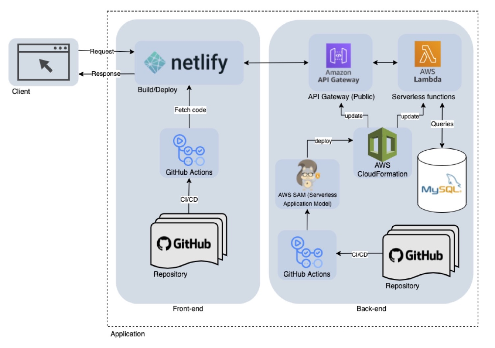
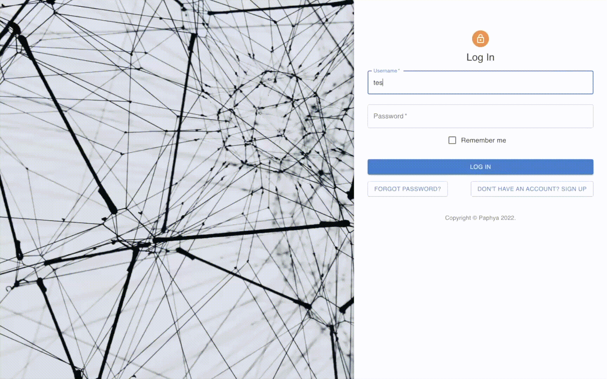

# Student-Alumni Connect Application (PAPHYA)

This is a collaborative project with Gabriel P., Qian Y., Sharayu P., and myself.

## Motivation

The web application project aims to provide a platform for students to leverage and to connect 
with the university alumni network. The application provides a platform for users to become mentors 
and mentees in learning and sharing career or academics-related experiences. This mentor-mentee 
relationship could help students better understand after-college career paths.

## Application Architecture

- ****Front-end****: React, Redux, MUI, Jest, Husky, Netlify, Github Actions, Postman.
- ****Back-end****: MySQL, NodeJS, AWS (SAM, CloudFormation, Lambda, API Gateway).



## Demo & Use Cases

****User Features****: User can view directory + make connections.


****Admin Features****: Admin can provide assistance to general user with console.



## Get Started: Front-End

Note that this repository only contains front-end codebase. Back-end codebase might be added at a future date.

### Installation

- React: https://reactjs.org/
- Redux: https://redux.js.org/
- MUI: https://mui.com/
- React Testing Library: https://testing-library.com/
- React Styleguidist: https://react-styleguidist.js.org/

### Repository Structure
```text
.
├── __mocks__                   # specific configurations
├── .husky                      # pre-commit hooks configurations
├── node_modules                # all installed packages and dependencies
├── public                      # placeholder folder
├── src                         # contains all React javascript code
│   ├── components              # components for a page (data is fetched & displayed)
│   ├── images                  # images
│   ├── pages                   # individual pages using components
│   ├── repositories            # store URLs of APIs
│   ├── static                  # static json data
│   ├── store                   # API actions through redux
│   └── index.js                # routing
├── styleguide                  # built documentation in html format
├── tests                       # contain all Jest testings
│   ├── components              # test components
│   ├── pages                   # test pages
│   ├── repositories            # test repositories
│   ├── store                   # test redux store
├── package.json                # package installations defined
├── README.md                   # Front-end Developer Documentation
└── styleguide.config.js        # styleguide documentation tool configurations
```

### How to Use

Run the following command to download all packages defined in `package.json`.
It will also update the contents of `node_modules` folder.
```console
npm install
```

To run application and start a local web server:
```console
npm start
```

To run test and generate coverage report:
```console
npm test -- --coverage
```

To run interactive documentation:
```console
npx styleguidist build
npx styleguidist server
```
When adding and committing new code from local to github, `husky` pre-commit hook has been 
set up so that the repository will be regressively tested with the existing testing suites.
Once passing all tests, code can then be pushed. Additionally, github actions can be set up 
to perform CI/CD.

## License

[MIT License](LICENSE)
